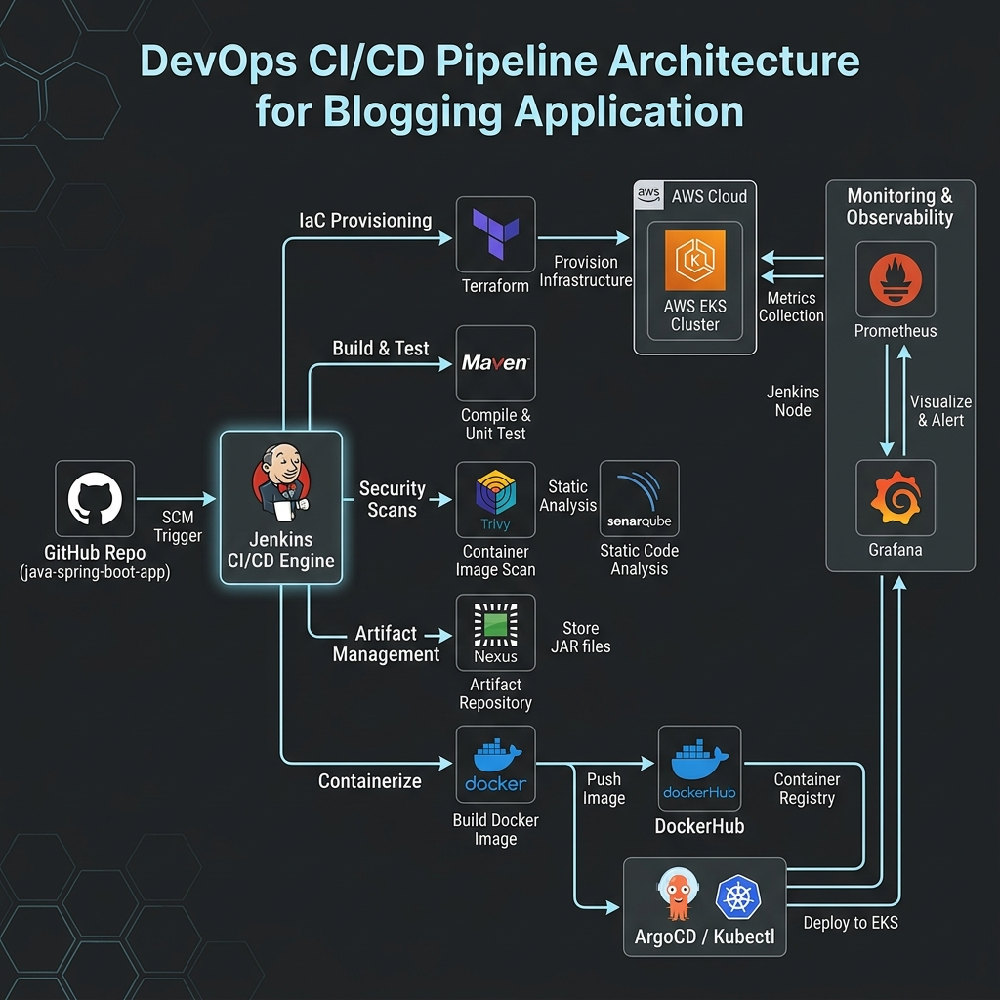
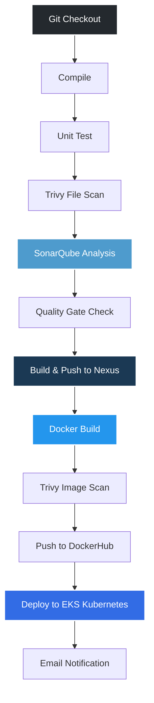
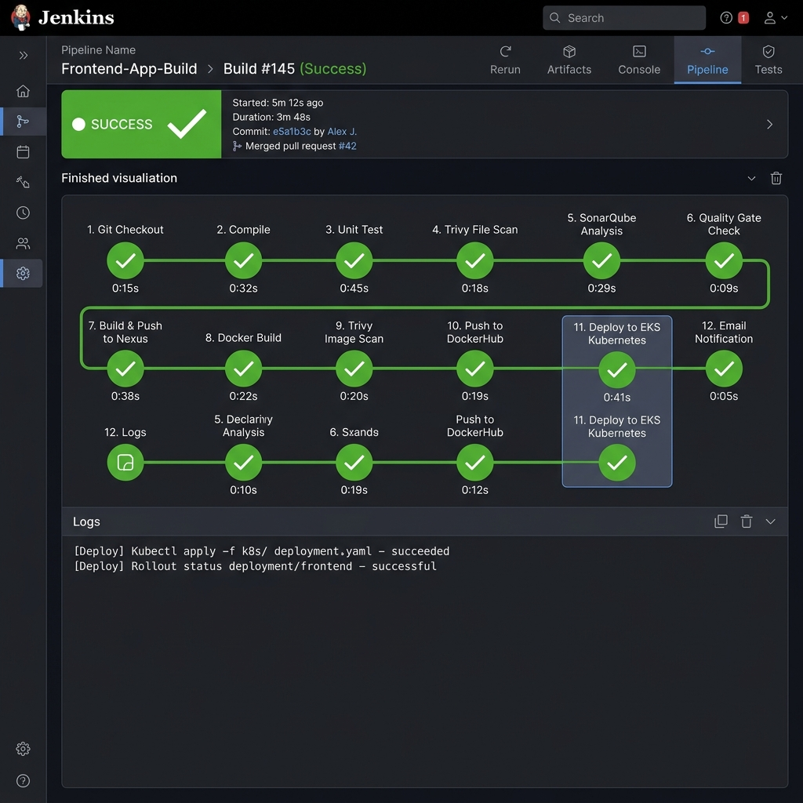
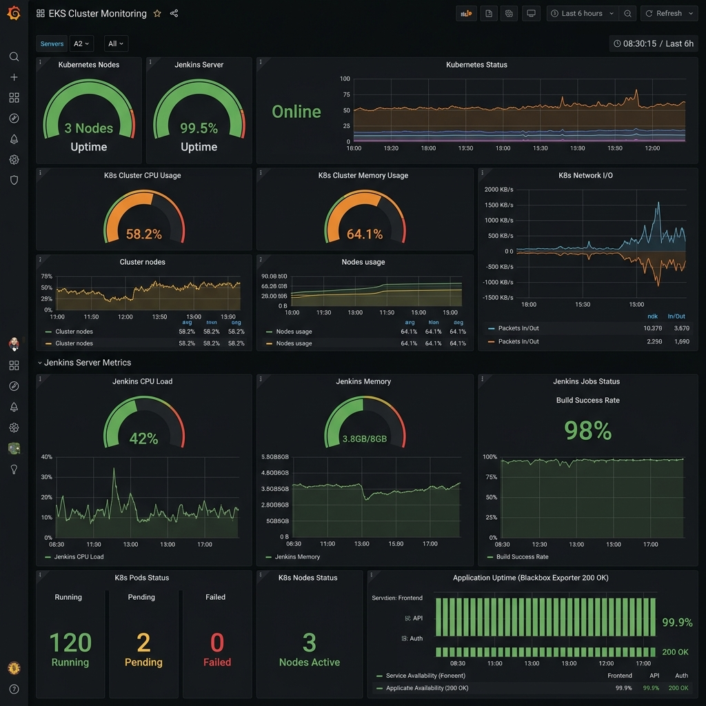

# End-to-End DevOps CI/CD Pipeline for a FullStack Blogging App

## 🚀 Project Overview
I built a production-ready FullStack Blogging Application using **Java (Spring Boot)** and fully automated its deployment using modern DevOps tools. The application is containerized with **Docker**, orchestrated using **Kubernetes**, and deployed on **AWS EKS**.

To ensure high code quality and security, I integrated a robust CI/CD pipeline using **Jenkins** that includes static code analysis, vulnerability scanning, and secure artifact management. Finally, I configured complete infrastructure monitoring to keep track of the application's health.

## 🛠️ My Tech Stack & DevOps Tools
* **Application**: Java Spring Boot, RESTful APIs
* **Infrastructure as Code (IaC)**: Terraform
* **Cloud Provider**: AWS (EKS, EC2, VPC)
* **Containerization & Orchestration**: Docker & Kubernetes
* **CI/CD**: Jenkins
* **Code Quality**: SonarQube
* **Security Scanning**: Trivy
* **Artifact Management**: Nexus
* **Monitoring**: Prometheus, Grafana, Blackbox & Node Exporters
* **Alerting**: Gmail SMTP integration for deployment emails

---

## 🏗️ Infrastructure Architecture


To run this pipeline, I provisioned several servers on AWS:
1. **AWS EKS Cluster**: The main cluster where the application pods run.
2. **Jenkins Server (t2.large)**: The heart of the CI/CD automation.
3. **SonarQube Server**: Analyzes the code for bugs and vulnerabilities.
4. **Nexus Server**: Stores the built artifacts securely.
5. **Monitoring Server**: Runs Prometheus and Grafana.

---

## ⚙️ Step-by-Step Implementation

### 1. Infrastructure Provisioning (Terraform)
Instead of clicking through the AWS console manually, I wrote Terraform scripts to automate the creation of my VPC, Subnets, Security Groups, and the EKS Cluster itself.
```bash
cd terraform
terraform init
terraform apply --auto-approve
```
After the cluster was created, I connected my local machine to the cluster using the AWS CLI and verified the nodes were running.

### 2. Kubernetes RBAC (Role-Based Access Control)
Security is critical, so I didn't give Jenkins full admin access. Instead, I created a specific `ServiceAccount` and `RoleBinding` in Kubernetes that only grants Jenkins the exact permissions it needs to deploy the application in the `webapps` namespace.

### 3. Setting Up the Tooling Servers
I installed Docker on all my EC2 instances (using rootless mode for better security). Then, I spun up my DevOps tools:
* **SonarQube**: I deployed SonarQube via Docker, created an authentication token, and set up a Webhook so it can communicate back to Jenkins when a code scan passes or fails.
* **Nexus**: I deployed Nexus via Docker to store my Maven releases and snapshots securely.
* **Trivy**: I installed Trivy on the Jenkins server to scan my Docker images for CVEs (Common Vulnerabilities and Exposures) before pushing them to the registry.

### 4. Jenkins CI/CD Pipeline Configuration
I installed Jenkins and configured the necessary plugins (Docker, Kubernetes, SonarQube, Maven). I securely stored all my credentials (GitHub, DockerHub, SonarQube, AWS) in Jenkins' Credentials Manager to keep my secrets out of the source code.

My declarative pipeline (`Jenkinsfile`) automatically executes the following stages whenever code is pushed to GitHub:





1. **Git Checkout**: Pulls the latest code.
2. **Compile & Unit Test**: Uses Maven to build and test the Java app.
3. **Trivy File Scan**: Scans the filesystem for vulnerabilities.
4. **SonarQube Analysis**: Checks code quality and enforces the Quality Gate.
5. **Build & Push to Nexus**: Stores the compiled artifact.
6. **Docker Build**: Packages the app into a Docker image.
7. **Trivy Image Scan**: Scans the Docker image for severe vulnerabilities.
8. **Push to DockerHub**: Uploads the secure image.
9. **Deploy to Kubernetes**: Applies the manifest files to update the live EKS cluster.
10. **Email Notification**: Sends a success/failure email using Gmail SMTP.

### 5. Monitoring & Observability
I set up **Prometheus** to scrape metrics from my servers and deployed **Grafana** to visualize the data.
* **Node Exporter**: Monitors CPU, RAM, and disk usage of my Jenkins and Kubernetes nodes.
* **Blackbox Exporter**: Probes my live application endpoints over HTTP to ensure they are returning `200 OK` status codes.

I connected Prometheus to Grafana as a data source and imported pre-built dashboards to create a beautiful, real-time observability center.



---

## 🏁 Conclusion
By building this project, I gained hands-on experience designing and deploying a true enterprise-grade architecture. I successfully implemented the "Shift-Left" security methodology and achieved a zero-touch, fully automated deployment workflow!
